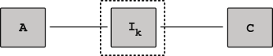
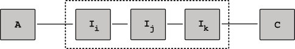

# Virtual-channels

Consider the following scenario. Alice and Charlie enter into a contract with a single intermediary Bob. Alice locks up amount **a0**, similarly, Charlie locks up amount **c0**. The channels total collateral can be assigned to variable **k** where, **k = a0 + c0**. Bob, an intermediary actor, offers to lock up funds **b0** in exchange for some specified return **r**.

The result of these agreements creates a virtual chain composed of two virtual channels with actors Alice, Charlie and intermediary Bob.

  

We define the following four protocols:

  1. Virtual channel establishment
  2. Offchain transactions
  3. Ejections/Evictions
  4. (Un)Cooperative channel closure

### Channel establishment

Establishing a virtual chain has the following sub components.
  1. Channel A,IB
  2. Channel IB,C  

    

    
    

      

The actors Alice, Charlie follow the following procedure :
  1. Contract Audit
  2. Post Audit coin Transfer.  
     - This contract is not yet submitted to on chain
  3. Post audit state submission

Alice and Charlie have now locked their coins in the channel with intermediary Bob.

### Offchain state transitions
Offchain transactions are simply state transitions (for example playing a game of chess. Moving a piece on the board changes the sate of the game).  

We define the following protocol governing changes in state:

  1. Alice moves (ex: b5 to d5 ) : **Am1**
  2. Alice increments counter by 1
  3. Alice signs the state **Asig**
  4. Alice sends **Am1**,**Asig**, **Acounter** to Charlie.
  5. Charlie receives and reviews Alices, **Asig**, **Am1**, and compares that the counter is larger than the counter he has.
  6. Charlie reviews Alice's state.
  7. Charlie increments his counter, **Ccounter</counter>**.
  8. Charlie signs the state,**Csig**
  9. Charlie sends his signature of Alice's state update back to Alice.
  7. Both Alice and Charlie now have the same game states which they both agree upon.

This continues until the both Alice and Charlie finish the game.

Note: We can define game states here, i.e.

 - (i)  (w,l)
 - (ii) (l,w)
 - (iii) (l,l) / (w,w)

### Channel closure

#### Cooperative Channel Closure
In this case, both Alice and Charlie have entered into the channel, both parties exchange a series of states until and a winner chosen - concluding the game. The following protocol defines a cooperative channel closure.

Procedure:   

TBD

#### Uncooperative Channel Closure
A single party in the channel is stalling the game state and preventing a cooperative closure. The channel closure follows a dispute resolution protocol for an uncooperative party.

Procedure:

TBD

### Ejections/Evictions  

We define the following types of ejections :
  1. Single-party ejection
  2. Multi-party ejection  

#### Single Party Ejection  

Single party ejection.

#### Multi Party Ejection

  

  
