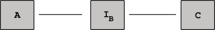
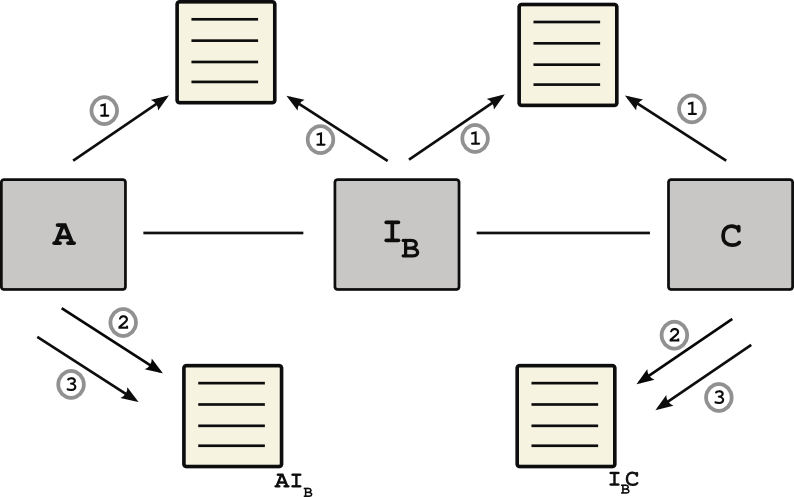

# Virtual-channels

Consider the following scenario. Alice and Charlie enter into a contract with a single intermediary Bob. Alice locks up amount **a0**, similarily, Charlie locks up collateral **c0**. The total channel   with a total collateral then, **k = a0 + c0**. Bob, the intermediary, offers to lock up funds equal to (**b0 = k**) in exchange for some specified reteurn **r**. This results in a single direction payment chanel between Alice and Charlie with intermediary Bob.

  

We define the following four protocols:

1. Virtual channel establishment
2. Offchain transactions
3. Ejections/Evictions
4. (Un)Cooperative channel closure

### Virtual channel establishment
Establishing a virtual chain has the following sub components.
  1. Channel A,IB
  2. Channel IB,C  

  

  
  

    

Alice has the following proceedure :
  1. Alice contract Audit
  2. Transfer ether to contract.  
     - This contract is not yet submitted to on chain
  3. State submission to contract

Similarily, the proceedure Bob follows:
  1. Bob contract Audit
  2. Transfer ether to contract.  
    - This contract is not yet submitted to on chain
  3. State submission to contract

### Offchain transactions

### Ejections/Evictions

### (Un)cooperative channel closure
